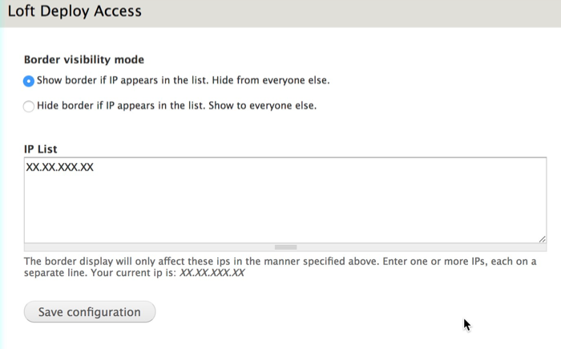

# Loft Deploy

## Summary
This module wraps non-production instances of your website in a colored border to indicate that you are elsewhere than production.  This helps me to keep track of where I am when switching from prod, staging and dev, where otherwise every site looks the same.  I've found the colors prevent me from making mistakes.

**Visit <https://github.com/aklump/drupal_loft_deploy> for full documentation.**

## Contributing

If you find this project useful... please consider [making a donation](https://www.paypal.com/cgi-bin/webscr?cmd=_s-xclick&hosted_button_id=4E5KZHDQCEUV8&item_name=Gratitude%20for%20aklump%2Floft_deploy).

## Installation

1. Download and unzip this module into your modules directory.
1. Goto Administer > Site Building > Modules and enable this module.

## Configuration

Unless defined as seen below, the site role is always `prod`. So, except in production environments, you must add either of the following to your _settings.local.php_ file to indicate the site role for that environment.

### For local developement add
    
    !defined('DRUPAL_ENV_ROLE') && define('DRUPAL_ENV_ROLE', 'dev');

### For a staging site add
    
    !defined('DRUPAL_ENV_ROLE') && define('DRUPAL_ENV_ROLE', 'staging');

Be aware that modules can alter this value using `loft_deploy_site_role_alter()`.

### Can I restrict the border by IP?

Yes.

Let's say you are using this on a staging site and several people are looking at it, not all of whom appreciate the colored border as much as you do.  Well, you can enable the included loft_deploy_ip submodule and you can hide or show based on an IP list at _/admin/config/development/loft-deploy_.

For the scenario mentioned, here's how I would configure it, where `XX.XX.XXX.XX` is my public IP address.  This way I will always see the staging border, but my clients don't have to be bothered by it.

### Should I Enable on Production?

Yes, usually.

If you keep this enabled on production, then you will not have to do anything when you copy your database to your local or staging environments.  If you do not keep it enabled, then you will have to remember to manually enable this module every time you sync your database.  This is not realistic.  Alternatively, you may automate the enabling of this module when your database is synced, but my vote is to just keep it enabled everywhere, since this is the simplest and most reliable.

This module has no measurable affect on a production website as it's been highly optimized for speed, so that idea should not deter you.

### Site Role / Border Color

* Each instance of your website is one of: production, staging or dev. The color of the border around the non-production sites informs you as to it's role.  There's one more distinction between a site role dev with master branch, and a site role dev with a develop branch; this adds a fourth color.

* Obviously, production instances will not have a border.

* You will need to flush Drupal caches each time you change your site role in _settings.php_.

## Default Colors

    SITE ROLE - GIT BRANCH - COLOR
    prod        n/a         n/a
    staging     n/a         green
    staging     feature     orange
    dev         master      pink
    dev         develop     aqua
    dev         feature     yellow

## Info Title

At the bottom of the page, you will see a readout of information, the _title_. By default this will display the site role, and the gitflow parent and current git branch, if you are using git.

Click this title to hide the visual border until next request.

Click while holding down CMD or CTRL to hide it for 10 minutes.  The duration of this can be controlled using _settings.php_, e.g.:

    // Define the number of seconds to disable the border when clicking the metakey.
    $config['loft_deploy.settings']['meta_timeout'] = 1200;

You may alter the title that is displayed at the bottom of the screen by adding the following to _settings.local.php_ or _settings.php_, where the token `!site_role` will print the site role.  Other tokens are: `!git` and `!gitflow`.

    $config['loft_deploy.settings']['border_title'] = 'Title Override';

### Troubleshooting Git

You may need to indicate the exact path to your Git binary, if so do like this in _settings.php_.

    $settings['loft_deploy.git'] = "/some/path/to/git";

## Advanced Theming

Refer to `.loft-deploy` and it's classes for css overriding.

You may add additional css classes to `.loft-deploy` in _settings.local.php_, e.g.,
    
    $settings['loft_deploy.css_classes'][] = 'my-special-class';

You may explicitely set the border color like this:

    $settings['loft_deploy.border_color'] = 'red';

You may explicitely set the text color like this:

    $settings['loft_deploy.title_color'] = 'green';

## Gotchas

* If your site role changes, you may need to empty all caches to see the changes appear.

## Always Hide the Border

Add the following to `settings.local.php` and the border will not show, ever, for any reason.  Why would you do this? Not sure.

    $settings['loft_deploy.hide_border'] = false;
