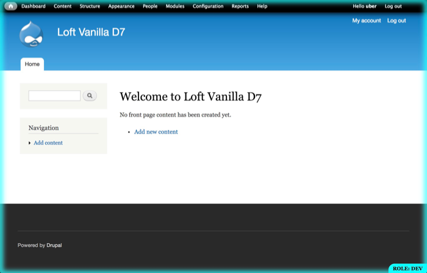

# Loft Deploy

## Summary

This module helps visually distinguish dev, staging and production website roles by applying a colored border around non-production sites.  Additional visual feedback is provided including: the current git branch, and gitflow parent, when applicable.

**Visit <https://aklump.github.io/loft_deploy> for full documentation.**

## Quick Start

## Requirements

* Expecting to find _settings.local.php_.

## Contributing

If you find this project useful... please consider [making a donation](https://www.paypal.com/cgi-bin/webscr?cmd=_s-xclick&hosted_button_id=4E5KZHDQCEUV8&item_name=Gratitude%20for%20aklump%2Floft_deploy).

## Installation

1. Download and unzip this module into your modules directory.
1. Goto Administer > Site Building > Modules and enable this module.

## Configuration
This is not just a "dev module" as such, you should enable this module on production; though you won't see any visual changes to production it will insure that when you dump your prod database and import it to dev or staging, that the module is enabled and can begin to make the visual distinctions on the dev and staging sites. This module has no measurable affect on a production website as it's been highly optimized for speed.

### How Is the Role Defined?

Unless defined, role is always `prod`. So, except in production environments, you must add either of the following to your _settings.local.php_ file:

    !defined('DRUPAL_ENV_ROLE') && define('DRUPAL_ENV_ROLE', 'dev');
    !defined('DRUPAL_ENV_ROLE') && define('DRUPAL_ENV_ROLE', 'staging');

Be aware that modules can alter this value using `loft_deploy_site_role_alter()`.

## Site Role / Border Color

* Each instance of your website is one of: production, staging or dev. The color of the border around the non-production sites informs you as to it's role.  There's one more distinction between a site role dev with master branch, and a site role dev with a develop branch; this adds a fourth color.

* Obviously, production instances will not have a border.

* If using _settings.local.php_ format, the $site_role variable will inform this module of the role of the site.

* If not you should add the following to _settings.php_; take note that adding the `$conf variable` as shown here will override what you have in settings.local.php, if in fact you have anything there.

* You will need to flush Drupal caches each time you change your site role.

## Determining Site Role

The site role will be taken by the first value found in the following cascade:

    DRUPAL_ENV_ROLE
    variable_get('loft_deploy_site_role')

## _settings.php_ example

    // One of 'prod', 'staging', or 'dev'
    $conf['loft_deploy_site_role'] = 'staging';

## Default Colors

    SITE ROLE - GIT BRANCH - COLOR
    prod        n/a         n/a
    staging     n/a         green
    staging     feature     orange
    dev         master      pink
    dev         develop     aqua
    dev         feature     yellow

## Info Title

At the bottom of the page, you will see a readout of information, the "title". By default this will display the site role, and the gitflow parent and current git branch, if you are using git.

Click this title to hide the visual border; CMD or CTRL click this to hide it for 10 minutes.  The duration of this can be controlled using _settings.php_, e.g.:

    // Define the number of seconds to disable the border when clicking the metakey.
    $conf['loft_deploy_meta_timeout'] = 600

You may alter the title that is displayed at the bottom of the screen by   adding the following to _settings.local.php_ or _settings.php_, where the token '!site_role' will print the site role.  Other tokens are: !git and !gitflow.

    $conf['loft_deploy_site_title'] = '!site_role - !git > !gitflow'

## Advanced Theming

Refer to `div.loft-deploy` and it's classes for css overriding.

You may influence the css classes on `div.loft-deploy` by adding, as an example:

    $conf['loft_deploy_css_class'] = 'my-cool-class';

You may explicitely set the border color like this:

    $conf['loft_deploy_border_color'] = '#BD8FDB'

You may explicitely set the text color like this:

    $conf['loft_deploy_title_color'] = '#fff'

## Gotchas

* If your site role changes, you may need to empty all caches to see the changes appear.

## Quick hide border always

Add the following to `settings.local.php` and the border will not show, ever, for any reason.

    $conf['loft_deploy_border'] = FALSE;
